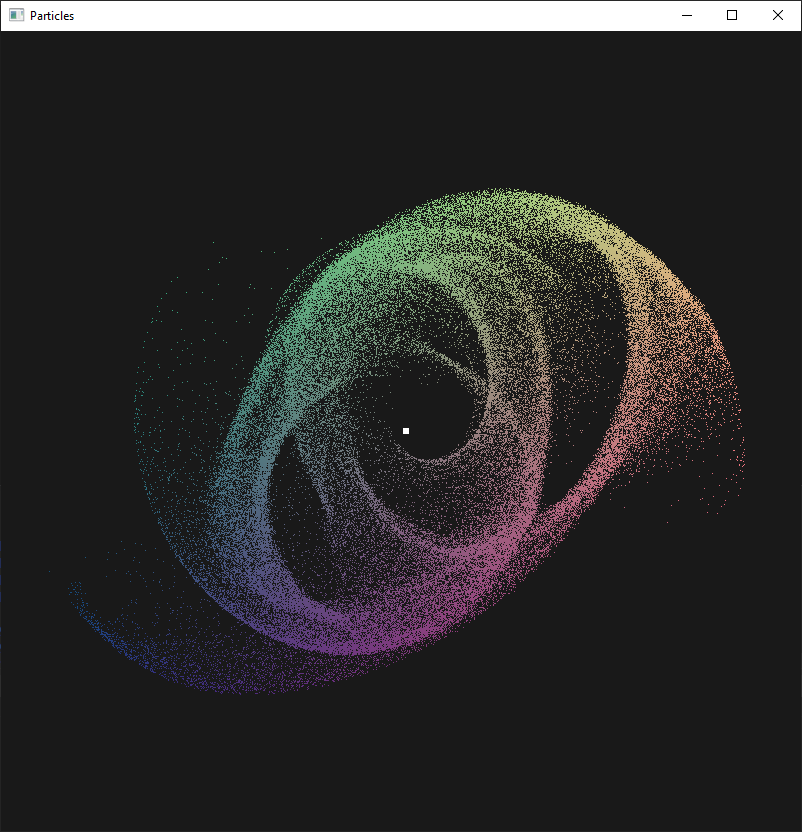
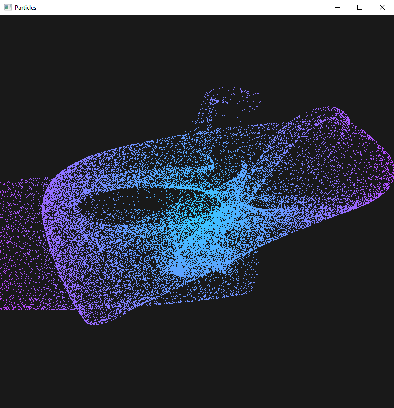
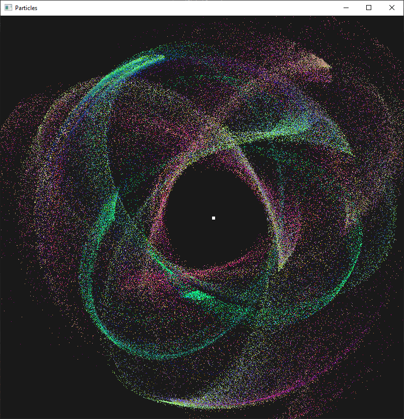

# Particles
Simulate millions of particles simultaneously on the GPU

## Properties
* Allocates an OpenGL vertex buffer which is shared by OpenCL
* OpenCL kernels calculate particle position every frame
* No data is moved after initial setup (if lifetime is disabled), which gives significantly improved performance

## Performance
Computer specs:  
CPU: Ryzen 5 2600  
GPU: GTX 1060 6GB  

The table below shows the average framerate for a given particle count.

|  Particles | Framerate |  Frametime | Lifetime? |
|:----------:|:---------:|:----------:|:---------:|
|    100 000 |   1408.64 |     0.71ms |        no |
|    100 000 |    359.85 |     2.78ms |       yes |
|  1 000 000 |    413.63 |     2.42ms |        no |
|  1 000 000 |     64.97 |    15.39ms |       yes |
|  3 000 000 |    155.32 |     6.44ms |        no |
|  3 000 000 |     26.87 |    37.22ms |       yes |
|  5 000 000 |    109.36 |     9.14ms |        no |
| 10 000 000 |     58.75 |    17.02ms |        no |

Moving data between the CPU and GPU causes a large performance loss, even for small amounts of data. 

## Controls
* [M1] place gravitor
* [M2] place repulsor
* [WASD] rotate scene
* [SCROLL] change zoom level
* [SCROLL+V] change background R
* [SCROLL+B] change background G
* [SCROLL+B] change background B
* [KEYPAD +] increase particle size
* [KEYPAD -] decrease particle size
* [P] toggle movement
* [C] toggle gravity
* [ESC] exit

Hue shifting is not enabled by default.  
You need to change a few settings in 'OpenGL.cpp' and 'particle.fs' to make it work.
* [SCROLL+F] change hue
* [SCROLL+G] change saturation
* [SCROLL+H] change value

## Features
* Rotate the camera around the origin
* Create new gravitors/repulsors
* Shift particle HSV
* Shift background RGB
* Pause the simulation
* Zoom in/out

The following command-line arguments are supported:  
| Argument              | Description                |
|-----------------------|----------------------------|
| -p AMOUNT             | Initial particle count     |
| -e LIFETIME           | How long a particle lives  |
| -g GEN                | Choose generator (l/c/s)   |
| -b DURATION           | Benchmark duration seconds |
| --kernelsource FILE   | Source of OpenCL kernels   |
| --vertexshader FILE   | Vertex shader source       |
| --geometryshader FILE | Geometry shader source     |
| --fragmentshader FILE | Fragment shader source     |
| --mousegravity        | Drag particles with mouse  |

## Preview
  
  
  
  
  

## Libraries
The following libraries were used:  
* OpenCL
* OpenGL (GLFW)
* GLAD
* GLM
